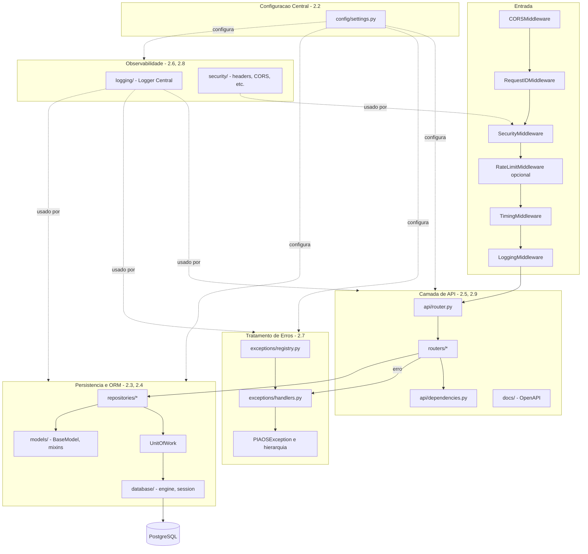

# Diagrama — Arquitetura Geral

Versão textual (Mermaid) de `architecture.drawio` — mantidas em sincronia
manualmente; esta é a fonte de revisão preferida (revisável em texto/PR),
o `.drawio` é para quem quiser editar visualmente.

## Como manter atualizado

Ao adicionar uma camada nova (ex.: um módulo de autenticação), adicione
um `subgraph` novo e as arestas de dependência reais — não redesenhe do
zero. Atualize `architecture.drawio` visualmente para refletir a mesma
mudança (ou peça a quem for editar visualmente que sincronize os dois).
