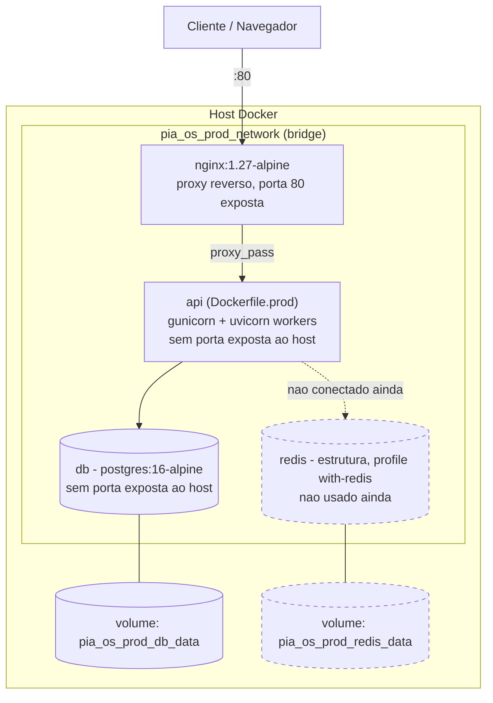

# Diagrama — Deploy (Self-Hosted / Produção)

Versão textual (Mermaid) de `deployment.drawio` — topologia do
`docker-compose.prod.yml` (Módulo 2.11).

## Como manter atualizado

Ao adicionar um serviço novo ao `docker-compose.prod.yml`, adicione o nó
correspondente aqui — a topologia deste diagrama deve sempre ser
derivável 1:1 do arquivo de compose real, nunca divergir dele.
