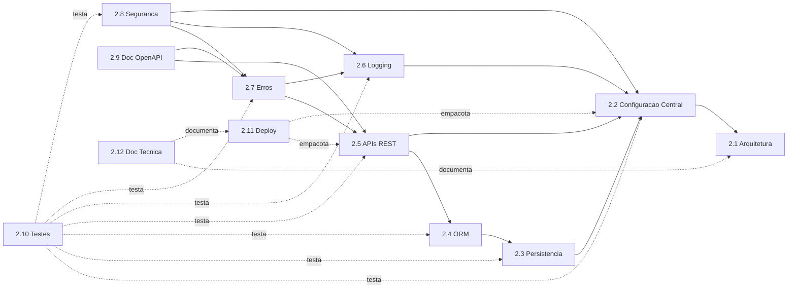

# Diagrama — Dependência entre Módulos

Versão textual (Mermaid) de `module_dependencies.drawio`. Seta A --> B
significa "A depende de B" (importa/usa).

## Regra de dependência observada

Nenhum módulo posterior altera a API pública dos anteriores sem uma
razão explícita e documentada (ver `docs/adr/`). A direção das setas é
estritamente "de trás para frente" — 2.2 nunca depende de 2.5, por
exemplo. Isso é o que permitiu implementar 2.1–2.11 sequencialmente sem
retrabalho estrutural.

## Como manter atualizado

Ao criar um módulo novo, adicione o nó e as arestas reais de import —
não presuma a partir do número do módulo. Se um módulo futuro
introduzir uma dependência "para trás" (algo cedo passando a depender de
algo tardio), isso é um sinal de possível problema arquitetural — vale
um ADR explicando a exceção.
