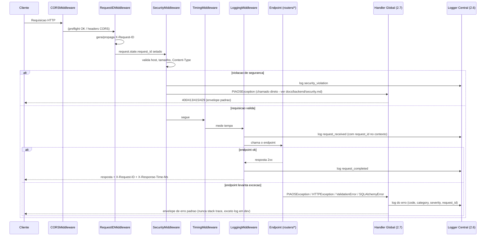

# Diagrama — Fluxo de Requisição (incluindo tratamento de exceção e logging)

Versão textual (Mermaid) de `request_flow.drawio`. Cobre o caminho feliz
e o de erro no mesmo diagrama (o de erro é o desvio a partir de
"Endpoint" quando uma exceção é levantada).

## Como manter atualizado

Se um middleware novo for inserido na cadeia, adicione o participante e
reordene conforme `main.py::create_app()` (a ordem real dos
`add_middleware` — documentada em `deploy/README_DEPLOY.md` e
`docs/backend/security.md`).
